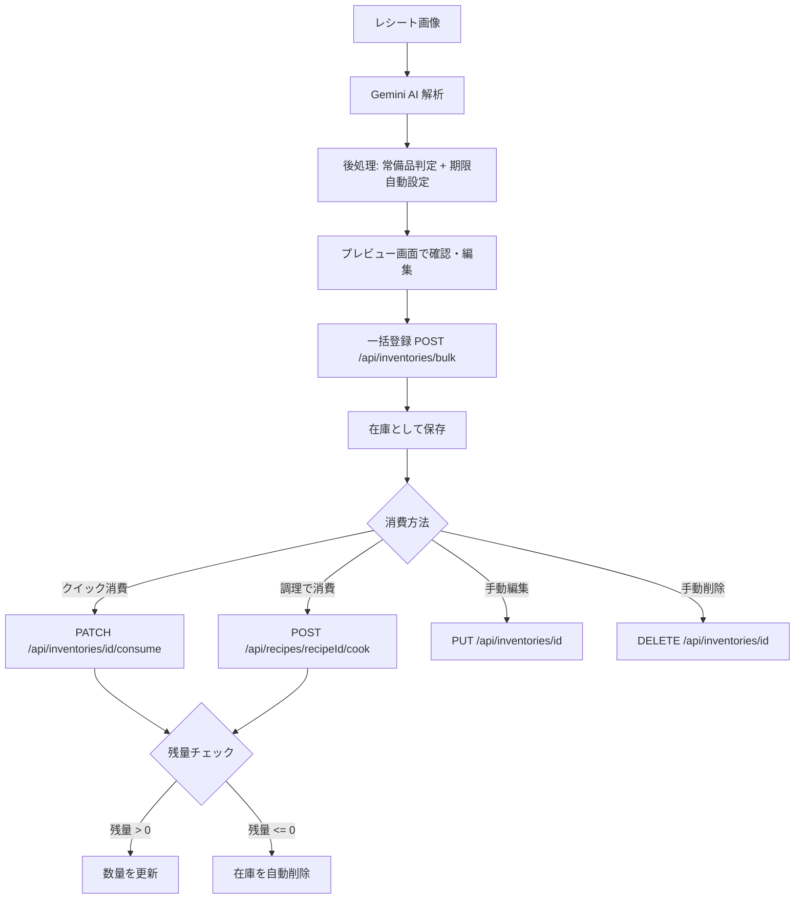
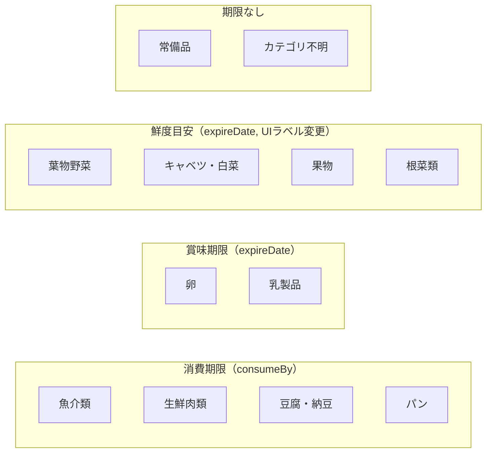
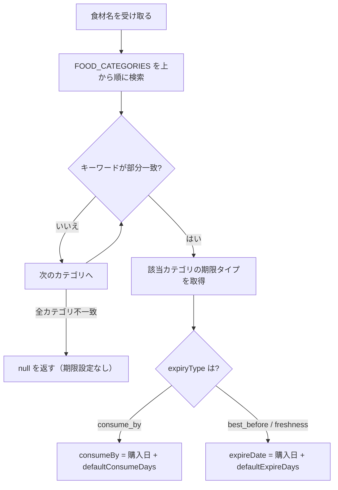
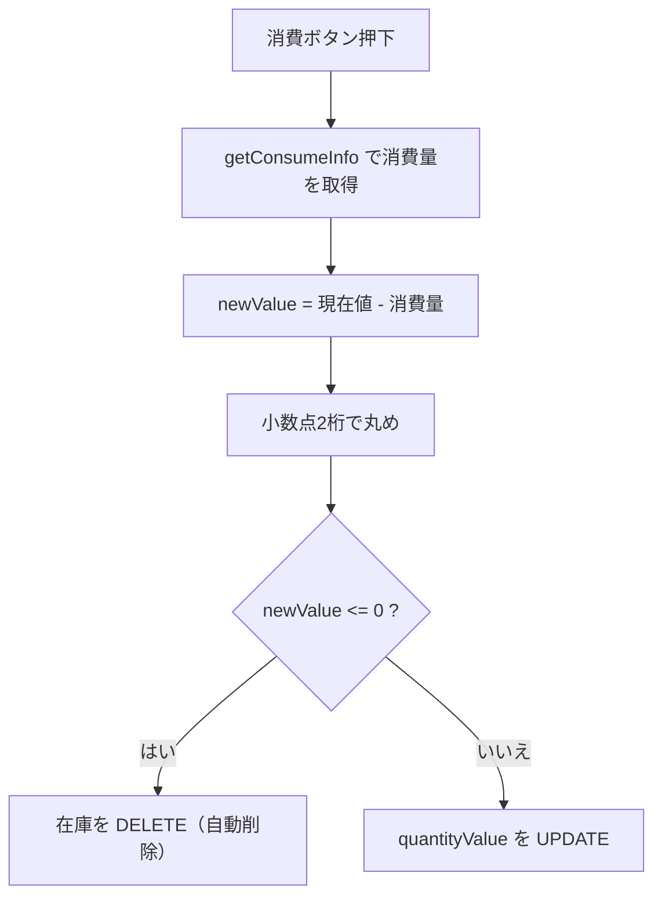
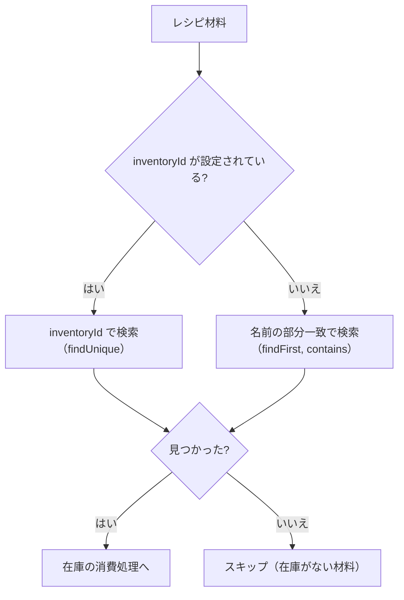
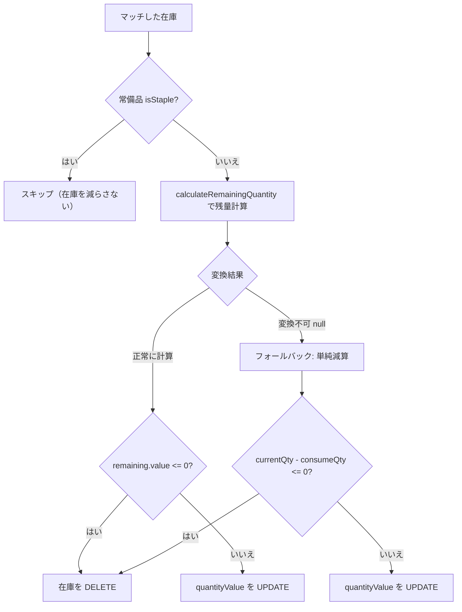

# 食材管理ロジック仕様書

## 1. 概要

本ドキュメントは、食材管理（在庫管理）のビジネスロジック全体を定義する。
レシート解析から在庫登録、日常の消費、調理による消費、自動削除までの一連の流れを網羅的に記述する。

API仕様・UI仕様の詳細は [inventory-spec.md](./inventory-spec.md) を参照。
単位変換の技術仕様は [unit-conversion-spec.md](./unit-conversion-spec.md) を参照。

### 食材ライフサイクル



### 関連ファイル一覧

| 分類 | ファイルパス | 役割 |
|------|-------------|------|
| レシート解析 | `app/api/analyze-receipt/route.ts` | レシート画像→食材リスト抽出 |
| 一括登録 | `app/api/inventories/bulk/route.ts` | 食材を在庫に一括登録 |
| 在庫CRUD | `app/api/inventories/route.ts` | 在庫一覧取得 |
| 在庫CRUD | `app/api/inventories/[id]/route.ts` | 個別の取得・更新・削除 |
| クイック消費 | `app/api/inventories/[id]/consume/route.ts` | ボタン1タップで消費 |
| 調理消費 | `app/api/recipes/[recipeId]/cook/route.ts` | レシピの材料分を一括消費 |
| 常備品判定 | `lib/food-category.ts` | 食材名→常備品フラグ判定 |
| 期限推定 | `lib/expiry-defaults.ts` | 食材名→期限タイプ判定・デフォルト期限設定 |
| 期限入力UI | `components/ExpiryDateInput.tsx` | 期限タイプ切り替えトグル + 日付入力 |
| 単位ロジック | `lib/units/constants.ts` | 単位定義・消費量・換算係数 |
| 単位ロジック | `lib/units/comparator.ts` | 数量比較・残量計算・消費情報 |
| 単位ロジック | `lib/units/converter.ts` | 単位間の変換処理 |
| 単位ロジック | `lib/units/normalizer.ts` | 表記ゆれの正規化・分数パース |
| データモデル | `prisma/schema.prisma` | Inventoryテーブル定義 |

---

## 2. レシート解析から在庫登録まで

### 2.1 全体フロー

```
レシート画像 → Gemini AI（構造化出力）→ 後処理 → プレビュー → 一括登録
```

### 2.2 Gemini 構造化出力スキーマ

`POST /api/analyze-receipt` で Gemini 2.0 Flash に送信する際、`responseSchema` で以下のスキーマを指定し、JSON形式のレスポンスを保証する。

| フィールド | 型 | 必須 | 説明 |
|-----------|------|------|------|
| `name` | string | はい | 食材・食品・飲料の名前（日用品は含めない） |
| `quantityValue` | integer (nullable) | いいえ | 数量（整数のみ） |
| `quantityUnit` | string (nullable) | いいえ | 単位（個、本、パック、袋、房、束、枚、玉、株、g、kg、ml、L） |
| `expireDate` | string (nullable) | いいえ | 賞味期限（YYYY-MM-DD形式） |
| `consumeBy` | string (nullable) | いいえ | 消費期限（YYYY-MM-DD形式） |
| `isStaple` | boolean | はい | 常備品ならtrue、使い切り食材ならfalse |

**プロンプトで指示する重要ルール:**

- 日用品（洗剤、ラップ等）は除外し、食べられるもの・飲めるものだけを抽出する
- 常備品は `quantityValue: 1`, `quantityUnit: "個"` または `"本"` で統一する
- 常備品の商品名の重量表記（例: バター200g）はパッケージ仕様であり、数量として扱わない
- 使い切り食材は、食材カテゴリに応じた最適な単位を選ぶ
- 数量不明の場合は `quantityValue: 1`, `quantityUnit: "個"` をデフォルトとする
- 数値は整数のみ（小数は使わない）

**カテゴリ別の数量記録ルール（プロンプトで指定）:**

| 食材カテゴリ | 数量の記録方法 | 例 |
|-------------|---------------|-----|
| 常備品（調味料・油等） | 必ず1個 or 1本 | バター → 1個, 醤油 → 1本 |
| 冷凍野菜 | パッケージ重量(g) | 冷凍ブロッコリー300g → 300g |
| 冷凍おかず | 袋 or 個 | 冷凍餃子12個入 → 1袋 |
| ヨーグルト（大容量） | 重量(g) | 400gヨーグルト → 400g |
| ヨーグルト（個装） | 個数 | 4個パック → 4個 |
| 食パン | 枚数 | 6枚切り → 6枚 |
| 牛乳・飲料 | 本 | 牛乳1L → 1本 |
| 肉・魚 | パック | 鶏むね肉 → 1パック |
| 野菜・果物 | 自然な個数単位 | レタス→1個, ネギ→1本, バナナ→1房 |
| 卵 | 個数 | 10個入り → 10個 |

### 2.3 後処理ロジック

Gemini の出力を受け取った後、以下の2つの補正処理を行う。

#### (a) 常備品フラグのダブルチェック

```
最終的なisStaple = (GeminiのisStaple === true) OR isStapleFood(食材名)
```

- Gemini が `isStaple: false` と判定しても、`isStapleFood()` が `true` を返せば常備品として扱う
- つまり、**Geminiの判定とキーワード辞書のOR条件**で最終判定する
- これにより、AIの判定漏れを防ぐ

#### (b) デフォルト期限の自動設定

以下の条件を**すべて**満たす場合にのみ、デフォルト期限を自動設定する:

1. 常備品ではない（`isStaple === false`）
2. Gemini が `expireDate` を返していない
3. Gemini が `consumeBy` を返していない

条件を満たした場合、`getDefaultExpiryDates(食材名)` を呼び出し、食材カテゴリに基づく期限を設定する。
詳細は「5. 賞味/消費期限の自動設定ロジック」を参照。

#### (c) 異常値のサニタイズ

Gemini が異常に長い数値（数千桁の浮動小数点）を返すことがあるため、レスポンスのJSONパース前に以下の処理を行う:

- 16文字以上の数値列を検出
- JavaScriptの `Number()` で安全な精度に変換
- 変換不可の場合は `0` にフォールバック

### 2.4 一括登録（トランザクション）

`POST /api/inventories/bulk` で在庫を一括登録する。

- SQLite は `createMany` をサポートしないため、`prisma.$transaction()` で個別の `create` を実行
- 配列の各要素を順に `prisma.inventory.create()` で挿入
- `items` が空配列の場合は 400 エラーを返す
- `isStaple` が未指定の場合は `false` をデフォルトとする

---

## 3. 調味料・常備品の管理単位ルール

### 3.1 基本方針

在庫の管理単位は**レシート解析時のパッケージ単位**を基本とする。レシピとの比較時に必要な換算は、密度テーブル（`lib/units/constants.ts` の `INGREDIENT_DENSITIES`）を使って自動的に行う。

### 3.2 カテゴリ別の管理単位

| 食材カテゴリ | 管理単位 | 例 | 備考 |
|-------------|---------|-----|------|
| 液体調味料 | VOLUME系（ml/L） | 醤油500ml、みりん1L | パッケージに容量表記があるため |
| 固形調味料 | MASS系（g/kg） | 砂糖1kg、塩500g | パッケージに重量表記があるため |
| 油類 | VOLUME系（ml/L）又はCOUNT系 | オリーブオイル500ml、ごま油1本 | レシートの表記に従う |
| バター | MASS系（g） | バター200g | パッケージにg表記が一般的 |
| マヨネーズ・ケチャップ | MASS系（g）又はCOUNT系 | マヨネーズ400g、ケチャップ1本 | レシートの表記に従う |
| 粉類 | MASS系（g/kg） | 小麦粉1kg、片栗粉200g | パッケージに重量表記があるため |

### 3.3 レシピとの換算パス

レシピでは「大さじ2」「小さじ1」のような計量スプーン表記が一般的。在庫がg/ml管理の場合、以下の換算パスで比較する:

```
在庫(g) <-> 密度テーブル <-> ml <-> 計量スプーン換算 <-> レシピ(大さじN)
```

**換算可能な組み合わせ:**
- バター200g、レシピ「バター大さじ2」→ 大さじ→ml(30ml)→g(28.5g) → 200g >= 28.5g → 十分
- 醤油500ml、レシピ「醤油大さじ3」→ 大さじ→ml(45ml) → 500ml >= 45ml → 十分

**換算不可の場合（COUNT系 <-> MASS/VOLUME）:**
- 在庫「サラダ油1本」、レシピ「油大さじ2」→ COUNT系とSPOON系は直接換算不可
- この場合、在庫に名前マッチがあれば `unknown` ステータス（在庫存在は認識するが過不足は判定不可）

換算可否の全パターンは [unit-conversion-spec.md](./unit-conversion-spec.md) の換算可否マトリクスを参照。

### 3.4 密度テーブル対応状況

`lib/units/constants.ts` の `INGREDIENT_DENSITIES` に以下が登録済み:

| カテゴリ | 登録済み食材 |
|---------|-----------|
| 基本調味料 | 醤油、みりん、酒、酢、味噌、砂糖、塩 |
| 油脂類 | 油（サラダ油/ごま油/オリーブオイル含む）、バター（無塩/有塩/マーガリン含む） |
| その他調味料 | はちみつ、マヨネーズ、ケチャップ、ソース |
| 乳製品 | 牛乳、生クリーム、ヨーグルト |
| 粉類 | 小麦粉（薄力粉/強力粉含む）、片栗粉、パン粉、ベーキングパウダー |

---

## 4. 常備品（isStaple）判定ロジック

### 4.1 概要

食材を「常備品」と「使い切り食材」の2タイプに分類する。

| タイプ | isStaple | 説明 | 調理時の扱い |
|--------|----------|------|-------------|
| 常備品 | `true` | バター、油、調味料など少量ずつ使う食材 | 在庫を減らさない |
| 使い切り | `false` | 肉、魚、野菜など1回の調理で消費する食材 | 在庫を減らす |

### 4.2 判定ロジック

`lib/food-category.ts` の `isStapleFood(name)` 関数で判定する。

**アルゴリズム:**
1. 食材名を小文字に変換する
2. `STAPLE_KEYWORDS` リストの各キーワードと部分一致チェックを行う
3. いずれかのキーワードが含まれていれば `true`（常備品）を返す

### 4.3 常備品キーワードリスト

| カテゴリ | キーワード |
|---------|-----------|
| 油脂類 | バター, マーガリン, オリーブオイル, オリーブ油, サラダ油, ごま油, 胡麻油, こめ油, 米油, なたね油, キャノーラ油, 油 |
| 基本調味料 | 醤油, しょうゆ, しょう油, 味噌, みそ, 塩, 砂糖, 酢, みりん, 味醂, 料理酒 |
| ソース・ケチャップ系 | ソース, ケチャップ, マヨネーズ, ドレッシング, ポン酢, めんつゆ, だしの素, ほんだし, コンソメ, 鶏ガラスープ |
| 粉類 | 小麦粉, 薄力粉, 強力粉, 片栗粉, パン粉, ベーキングパウダー, ホットケーキミックス |
| スパイス・香辛料 | こしょう, 胡椒, コショウ, カレー粉, ナツメグ, シナモン, わさび, からし, マスタード, 唐辛子, 七味, 一味 |
| 甘味料・蜂蜜 | はちみつ, 蜂蜜, ハチミツ, メープルシロップ, ジャム |
| 乾物・ストック品 | のり, 海苔, わかめ, ワカメ, 昆布, かつお節, 鰹節, ふりかけ, ごま, 胡麻 |

### 4.4 常備品の特別扱い

- **レシート登録時**: `quantityValue: 1`, `quantityUnit: "個"` or `"本"` で統一
- **調理時**: `isStaple === true` の食材は消費量を差し引かずスキップする
- **クイック消費**: 常備品も通常通りクイック消費の対象（手動管理用）
- **期限自動設定**: 常備品は期限の自動設定を行わない（手動入力に任せる）

---

## 5. 賞味/消費期限の自動設定ロジック

### 5.1 概要

レシート解析時、AIが期限を返さなかった**生鮮食材**に対して、食材カテゴリに基づくデフォルト期限を自動設定する。

- 対象: 生鮮食材のみ（期限が短く自動設定が有用なもの）
- 対象外: 調味料、飲料、缶詰、冷凍食品など長期保存品（手動入力に任せる）

### 5.2 期限タイプの考え方

日本の食品表示基準に基づき、食材には**1つの期限タイプ**だけを付与する。

| 期限タイプ | DB格納先 | UIラベル | 意味 | 対象食材 |
|-----------|---------|---------|------|---------|
| `consume_by`（消費期限） | `consumeBy` | 消費期限 | 安全に食べられる期限。過ぎたら食べない方が良い | 魚介類、生鮮肉類、豆腐・納豆、パン |
| `best_before`（賞味期限） | `expireDate` | 賞味期限 | 美味しく食べられる期限。過ぎても食べられる場合がある | 卵、乳製品 |
| `freshness`（鮮度目安） | `expireDate` | 鮮度目安 | 法的な期限表示がない生鮮野菜・果物の目安日数 | 葉物野菜、キャベツ・白菜、果物、根菜類 |

> **設計判断**: `freshness` は DB上は `expireDate` に格納し、UIのラベルのみ「鮮度目安」に切り替える。
> これにより DB スキーマの変更なしで3種類の期限タイプを表現できる。

### 5.3 食材カテゴリ→期限タイプのマッピング



### 5.4 食材カテゴリ別デフォルト期限

`lib/expiry-defaults.ts` で定義。上から順に検索し、最初にマッチしたカテゴリを使用する。
カテゴリごとに `expiryType` が設定され、適切な方のフィールドだけに日付がセットされる。

| カテゴリ | 期限タイプ | デフォルト日数 | DB格納先 | 代表的なキーワード |
|---------|:--------:|:----------:|:-------:|-----------------|
| 魚介類 | consume_by | 2日 | consumeBy | 鮭, サーモン, マグロ, 刺身, エビ, イカ, サバ, 魚 |
| 生鮮肉類 | consume_by | 3日 | consumeBy | 鶏, 豚, 牛, ひき肉, ハム, ベーコン, ソーセージ, 肉 |
| 葉物野菜 | freshness | 3日 | expireDate | レタス, ほうれん草, 小松菜, もやし, ニラ, 大葉 |
| パン | consume_by | 5日 | consumeBy | パン, 食パン, ベーグル, クロワッサン, バゲット |
| 豆腐・納豆 | consume_by | 7日 | consumeBy | 豆腐, 納豆, 油揚げ, 厚揚げ, こんにゃく |
| 乳製品 | best_before | 7日 | expireDate | 牛乳, ヨーグルト, チーズ, 生クリーム |
| キャベツ・白菜 | freshness | 7日 | expireDate | キャベツ, 白菜, ブロッコリー, セロリ, アスパラ |
| 果物 | freshness | 7日 | expireDate | りんご, バナナ, みかん, いちご, レモン, メロン |
| 根菜類 | freshness | 14日 | expireDate | じゃがいも, 人参, 玉ねぎ, 大根, かぼちゃ, ネギ, にんにく |
| 卵 | best_before | 14日 | expireDate | 卵, たまご, タマゴ |

### 5.5 判定フロー



- 購入日が指定されない場合は「今日」を基準とする
- どのカテゴリにもマッチしない食材は `{ expireDate: null, consumeBy: null }` を返す
- **重要**: カテゴリに応じて**片方のフィールドだけ**をセットし、もう片方は `null` にする

### 5.6 期限タイプの判定・表示に使用する関数

| 関数 | 定義場所 | 用途 |
|------|---------|------|
| `getExpiryType(foodName)` | `lib/expiry-defaults.ts` | 食材名→期限タイプ（`ExpiryType \| null`） |
| `getDefaultExpiryDates(foodName, purchaseDate?)` | `lib/expiry-defaults.ts` | 食材名→デフォルト期限（片方だけセット） |
| `EXPIRY_TYPE_LABELS` | `lib/expiry-defaults.ts` | 期限タイプ→表示ラベル（「消費期限」「賞味期限」「鮮度目安」） |
| `EXPIRY_TYPE_SHORT_LABELS` | `lib/expiry-defaults.ts` | 期限タイプ→短縮ラベル（「消費」「賞味」「鮮度目安」） |

### 5.7 自動設定しない食材

以下は長期保存が可能なため、プレビュー画面でユーザーが必要に応じて手動入力する:

- 調味料・油脂類（醤油、味噌、油、バター、ソース等）
- 飲料（ビール、ジュース、お茶等）
- 缶詰・レトルト食品
- 冷凍食品
- 上記カテゴリにマッチしないもの

### 5.8 UI上の期限表示

#### 在庫一覧（InventoryItem）

カテゴリに応じて**適切な1つの期限**だけを表示する:

- `consumeBy` がある → 「消費: 2/13」
- `expireDate` がある + 野菜/果物カテゴリ → 「鮮度目安: 2/18頃」
- `expireDate` がある + それ以外 → 「賞味: 2/18」
- どちらもない → 非表示

#### 編集・登録画面（ExpiryDateInput コンポーネント）

- トグルボタンで「消費期限 / 賞味期限（or 鮮度目安）」を切り替え可能
- 初期表示はカテゴリ自動判定、またはDB保存値から推定
- 日付入力は1つだけ表示（選択されたタイプに対応するフィールドに保存）
- トグル切り替え時、日付値はそのまま保持し、格納先フィールドだけ変更

#### 既存データとの互換性

- 旧データで `expireDate` と `consumeBy` の両方に値がある場合:
  - `consumeBy` を優先して「消費期限」として表示
  - 編集モーダルで保存すると、選択された方のみセットされる（自然にクリーンアップ）

### 5.9 ユーザーによる期限タイプの変更

- プレビュー画面・編集モーダルのトグルボタンで期限タイプを変更可能
- 変更時: 日付値を `expireDate` ↔ `consumeBy` 間で移動し、もう片方を空にする
- カテゴリ自動判定が間違っている場合、ユーザーが手動で修正できる

### 5.10 期限通知タイミング

- **消費期限（consumeBy）**: 3日前・1日前・当日に通知
- **賞味期限（expireDate）**: 7日前・3日前・当日に通知
- **鮮度目安**: DB上は `expireDate` のため、賞味期限と同じタイミングで通知
- レシピ生成時: 消費期限が近い食材を優先的に使用するようGeminiに指示

> **制限事項**: 鮮度目安（野菜・果物）は DB上 `expireDate` に格納されるため、
> 通知は賞味期限と同じ（7日前, 3日前, 当日）になる。
> 将来的に通知タイミングを分けたい場合は、通知生成時に `getExpiryType()` で追加判定が可能。

---

## 6. クイック消費ロジック

### 6.1 概要

在庫一覧画面のボタン1タップで食材を消費する機能。
`PATCH /api/inventories/[id]/consume` が処理する。

### 6.2 消費量の決定

`lib/units/comparator.ts` の `getConsumeInfo(quantityValue, quantityUnit)` で消費量を決定する。
消費量は **単位のカテゴリのみ** で決まる（数量は残量チェックにのみ使用）。

| 単位カテゴリ | 正規化後の単位 | 消費量 | ボタン表示 |
|:----------:|:----------:|:-----:|:--------:|
| COUNT | 個, 本, パック, 袋, 房, 束, 枚, 玉, 株, 切れ, 片 | 1 | `-1` |
| MASS | g | 100 | `-100g` |
| MASS | kg | 0.1 | `-100g` |
| VOLUME | ml | 100 | `-100ml` |
| VOLUME | L | 0.1 | `-100ml` |
| VOLUME | cc | 100 | `-100ml` |
| 未知の単位 | - | 1（ただし残量以下） | `-1` |

**null/undefined の扱い:**
- `quantityValue` が null/undefined → `1` として扱う
- `quantityUnit` が null/空文字 → `"個"` として扱う

### 6.3 消費時の動作フロー



**計算式:**
```
newValue = Math.round(Math.max(0, currentValue - consumeAmount) * 100) / 100
```

**特別ルール:**
- 残量が消費量以下の場合 → 残り全量を消費する（`consumeAmount = effectiveValue`）
- 消費後の残量が0以下 → 在庫レコードを自動削除する

---

## 7. 調理による在庫消費フロー

### 7.1 概要

レシピの「調理完了」操作で、レシピの全材料分を在庫から一括消費する。
`POST /api/recipes/[recipeId]/cook` が処理する。
すべての在庫更新は `prisma.$transaction()` 内で実行される。

### 7.2 材料と在庫のマッチングロジック

レシピの各材料に対して、以下の順序で在庫を検索する:



**マッチング優先順位:**
1. `inventoryId` による完全一致（IDが設定されている場合のみ）
2. `name` の `contains` による部分一致（`userId` でフィルタ済み）

> **注意:** 現在のAI生成レシピでは `inventoryId` が設定されないため、実質的に名前の部分一致マッチングが常に使用される。

### 7.3 消費処理の分岐

マッチした在庫に対して、以下の順序で処理を行う:



### 7.4 残量計算の詳細

`calculateRemainingQuantity(inventory, consumed)` は以下のロジックで動作する:

1. **同一単位の場合**: 直接減算（`inventory.value - consumed.value`）
2. **異なる単位の場合**: 消費量を在庫の単位に変換してから減算
3. **変換不可の場合**: `null` を返す → 呼び出し元で単純減算にフォールバック

単位変換の詳細は [unit-conversion-spec.md](./unit-conversion-spec.md) を参照。

### 7.5 レスポンスの内容

調理API は以下の情報を返す:

| フィールド | 説明 |
|-----------|------|
| `consumedIngredients` | 消費した材料のリスト |
| `skippedStapleIngredients` | 常備品のためスキップした材料リスト |
| `deletedInventoryIds` | 残量0で削除された在庫IDリスト |
| `updatedInventories` | 更新された在庫（ID, 名前, 残量） |

フロントエンドはこの `deletedInventoryIds` を使って、在庫一覧からアイテムを即座に除外する（楽観的UI更新）。

---

## 8. データモデル

### Inventory テーブル

`prisma/schema.prisma` で定義:

| カラム | 型 | 説明 |
|--------|------|------|
| `id` | String (UUID) | 主キー |
| `userId` | String | ユーザーID（外部キー） |
| `name` | String | 食材名 |
| `quantityValue` | Float? | 数量（nullable） |
| `quantityUnit` | String? | 単位（nullable） |
| `note` | String? | メモ |
| `imageUrl` | String? | 画像URL |
| `expireDate` | DateTime? | 賞味期限 |
| `consumeBy` | DateTime? | 消費期限 |
| `isStaple` | Boolean | 常備品フラグ（デフォルト: false） |
| `createdAt` | DateTime | 作成日時 |
| `updatedAt` | DateTime | 更新日時 |

**インデックス:**
- `(userId, updatedAt DESC)` — ユーザーごとの在庫一覧取得用
- `(expireDate)` — 賞味期限での検索用
- `(consumeBy)` — 消費期限での検索用

**リレーション:**
- `User` との多対一（`userId` → `users.id`）
- `Notification` との一対多
- `RecipeIngredient` との一対多

---

## 9. 参照ドキュメント

| ドキュメント | 内容 |
|------------|------|
| [inventory-spec.md](./inventory-spec.md) | 在庫のCRUD API仕様、UI仕様、画面遷移、エラーハンドリング |
| [unit-conversion-spec.md](./unit-conversion-spec.md) | 単位の正規化、換算テーブル、密度テーブル、比較ロジック、換算可否マトリクス |
| [DB_要件定義.md](../DB_要件定義.md) | データベーススキーマの要件定義 |
